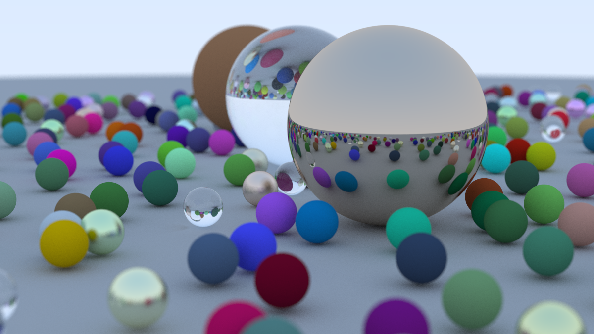

# Raytracer

Cross-plattform raytracer written in C++.

# Building

Requirements: `cmake`

In linux/macos:
```bash
cmake --build build --config release
./build/Raytracer >> render.ppm
```

In Windows:
```bash
cmake -B build
cmake --build build --config release
build\Release\Raytracer.exe >> render.ppm
```

# Usage
In the `main.exe` file create your `hittable` objects, set their position on the world, 
give them a material, and run the executable with the build command above. You can then 
visualize the image with image manipulation software, such as GIMP.

# Example


# Sources
[_Ray Tracing in One Weekend_](https://raytracing.github.io/books/RayTracingInOneWeekend.html)